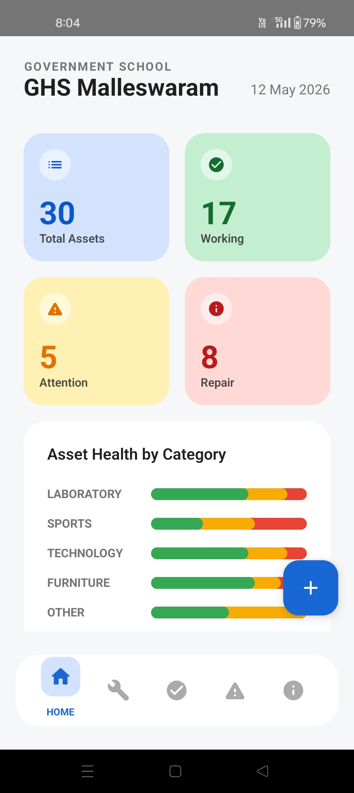
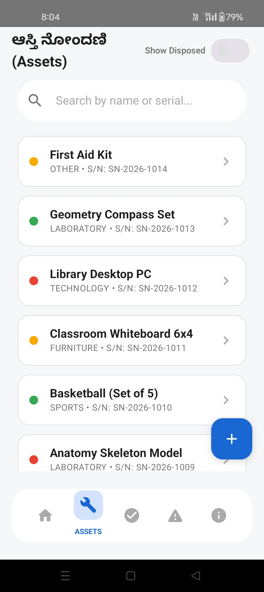
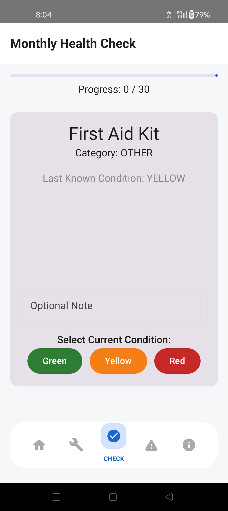
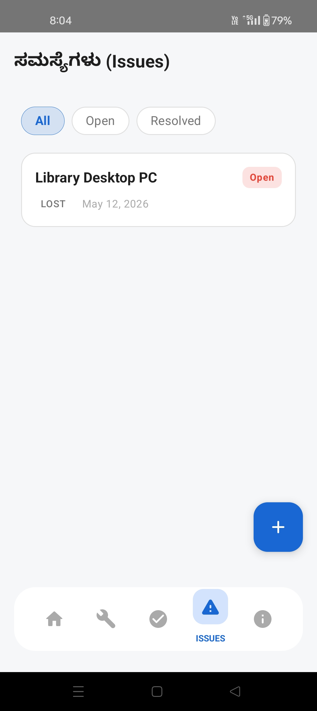
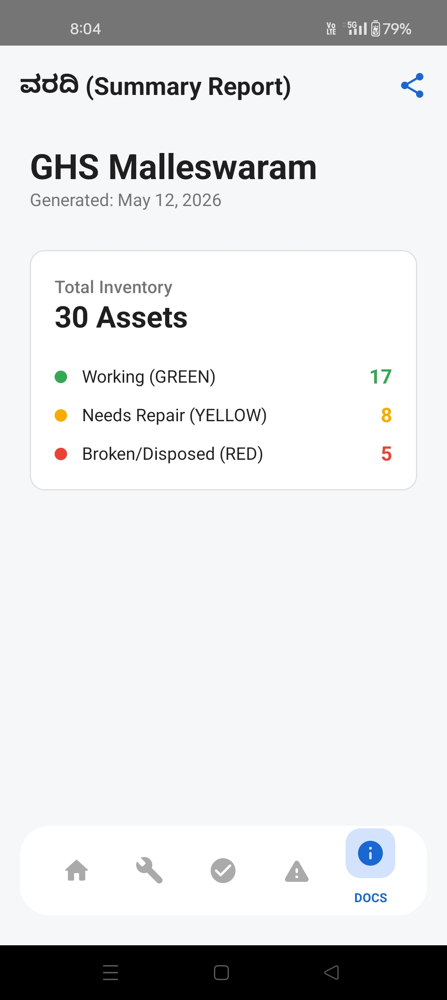

# Namma-Shaale Inventory

A modern, mobile-first Android application designed to help government schools track, manage, and maintain their physical assets efficiently.

## Overview
Managing school inventory shouldn't require complex, outdated spreadsheets. Namma-Shaale provides teachers and administrators with a clean, intuitive interface to catalog everything from laboratory equipment to sports gear. The app emphasizes visual health tracking, ensuring that broken, worn, or missing items are quickly flagged for repair or replacement.

## Key Features
* **Smart Dashboard:** An at-a-glance view of total assets, overall statuses (Working, Attention, Repair), and detailed health breakdowns by category.
* **Asset Management:** Easily add, edit, and categorize items (Technology, Furniture, Sports, Laboratory) along with their acquisition details and current conditions.
* **Health Checks:** Conduct routine audits and visual inspections to keep school inventory data accurate and up-to-date.
* **Issue Tracking:** Log specific problems (damaged, lost, worn out) and track repair requests until they are fully resolved.
* **Quick Onboarding:** A streamlined, PIN-secured setup process customized for individual school profiles (DISE Code, District, Block).

## App Interface

| Dashboard | Asset Management |
|:---:|:---:|
|  |  |

| Health Check | Issues Log |
|:---:|:---:|
|  |  |

| Summary Report | |
|:---:|:---:|
|  | |